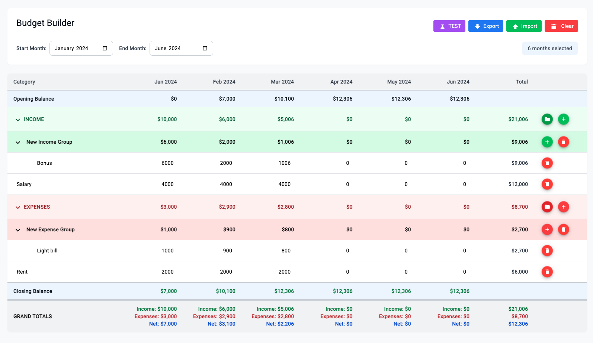

# Budget Builder - Angular

A comprehensive budget management application built with Angular 17, featuring monthly budget planning, income/expense tracking, and financial forecasting using modern Angular patterns and Signals.


## ✨ Features

- **Monthly Budget Planning** - Plan your budget across multiple months with flexible date ranges
- **Income & Expense Tracking** - Hierarchical categorization with parent/child relationships
- **Real-time Calculations** - Automatic totals, net income, and closing balances using Signals
- **Context Menu Operations** - Right-click context menu for bulk operations
- **Date Range Selection** - Customizable monthly planning periods
- **Export/Import Functionality** - Save and load budget data
- **Responsive Design** - Works seamlessly on desktop and mobile devices

## 🚀 Quick Start

### Prerequisites

- Node.js 18+ 
- npm or yarn

### Installation

1. **Clone the repository**
   ```bash
   git clone https://github.com/kels-git/budget-builder-angular.git
   cd budget-builder-angular
   ```

2. **Install dependencies**
   ```bash
   npm install
   ```

3. **Start development server**
   ```bash
   ng serve
   ```
   Navigate to `http://localhost:4200/`

## 🏗️ Architecture & Technologies

### Core Technologies
- **Angular 17** - Latest version with standalone components
- **TypeScript** - Type-safe development
- **Tailwind CSS** - Utility-first CSS framework
- **Angular Signals** - Reactive state management
- **RxJS** - Reactive programming library

### Key Components

#### BudgetTableComponent
The main budget management component featuring:
- **Signal-based State Management** - Reactive data flow with `budgetService` signals
- **Context Menu Integration** - Right-click operations for bulk actions
- **Date Range Management** - Flexible monthly planning
- **Hierarchical Categories** - Parent/child category relationships

#### Service Architecture
- **BudgetService** - Centralized state management using Signals
- **Reactive Updates** - Real-time calculations and data synchronization
- **CRUD Operations** - Add, update, delete categories and values

### Component Structure
```
BudgetTableComponent
├── DateRangeHeaderComponent
├── CustomBudgetTableComponent  
└── ContextMenuComponent
```

## 📋 Key Functionality

### Budget Management
- Add income/expense categories (both parent and child categories)
- Update category names and monthly values
- Delete categories with confirmation
- Hierarchical organization of budget items

### Date Range Features
- Custom start and end month selection
- Dynamic month generation based on range
- Opening balance carry-over between months

### Bulk Operations
- Apply values to all months via context menu
- Right-click context menu for quick actions
- Batch updates across multiple periods

### Real-time Calculations
- Monthly totals for income and expenses
- Net income calculations
- Closing balance computations
- Opening balance propagation

## 🎯 Usage

### Adding Categories
```typescript
// Add parent category
addParentCategory('income');

// Add child category to existing parent
onChildCategoryAdd(parentCategoryId);
```

### Updating Values
```typescript
// Update category value for specific month
onCategoryValueChange({
  categoryId: 'cat_123',
  monthKey: '2024-01',
  value: 1500
});
```

### Context Menu Operations
Right-click on any budget cell to access:
- Apply value to all months
- Quick edit operations
- Bulk updates

## 🔧 Development

### Building
```bash
ng build
```

### Running Tests
```bash
ng test
```

### Code Linting
```bash
ng lint
```

## 📁 Project Structure
```
src/app/
├── components/
│   ├── budget-table/
│   │   └── budget-table.component.ts
│   └── context-menu/
│       └── context-menu.component.ts
├── services/
│   └── budget.service.ts
├── shared/
│   └── ui/
│       ├── date-range-header/
│       └── custom-budget-table/
└── models/
    └── budget.model.ts
```

## 🤝 Contributing

1. Fork the repository
2. Create a feature branch (`git checkout -b feature/amazing-feature`)
3. Commit your changes (`git commit -m 'Add amazing feature'`)
4. Push to the branch (`git push origin feature/amazing-feature`)
5. Open a Pull Request

## 📄 License

This project is licensed under the MIT License - see the [LICENSE](LICENSE) file for details.

## 📞 Support

If you have any questions or issues, please open an issue on GitHub or contact the development team.

---

**Built with ❤️ using Angular 17 and modern web technologies**
## App Screenshot

<div style="display: flex; flex-wrap: wrap; gap: 10px;">
  
</div>
